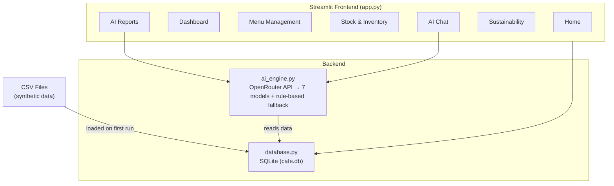
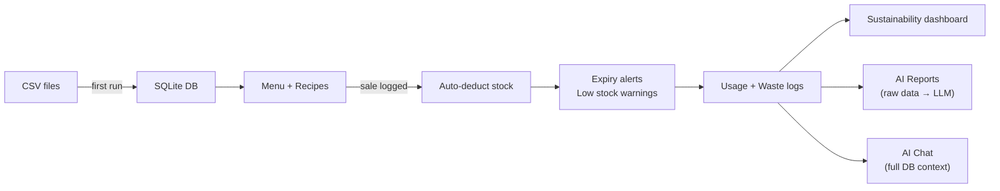

# Green Cafe Manager

**An intelligent inventory assistant for small cafes that tracks ingredients, predicts stock depletion, reduces food waste, and provides AI-powered business insights.**

Built for the Palo Alto Networks Case Study Challenge – Green-Tech Inventory Assistant scenario.

**Video Demo:** *[YouTube/Vimeo link will be added here]*

---

## Candidate Name
Aryan Banwala

## Scenario Chosen
Green-Tech Inventory Assistant

---

## Quick Start

### Prerequisites
- Python 3.10+
- pip

### Run Commands
```bash
git clone <repo-url>
cd cafe-project

python3 -m venv venv
source venv/bin/activate        # Windows: venv\Scripts\activate

pip install -r requirements.txt

# Optional: enable AI features
cp .env.example .env
# Edit .env → add your OpenRouter API key (get one at https://openrouter.ai/keys)

streamlit run app.py
```

### Test Commands
```bash
source venv/bin/activate
python -m pytest tests/ -v      # 13 tests (8 database + 5 AI engine)
```

---

## The Problem

Small cafes waste **10-20% of perishable ingredients** every month because:
- No system to track what expires when
- No visibility into which items drive the most waste
- Over-ordering based on gut feel, not data
- No connection between sales patterns and ingredient usage

A spreadsheet doesn't tell you *"Your bread waste is high because Cheese Toast isn't selling enough to use it up – push it as a combo with Cappuccino this weekend."*

An AI can.

---

## The Solution

Green Cafe Manager is a single Streamlit app with **7 pages** that gives a cafe owner everything they need:

| Page | What It Does |
|------|-------------|
| **Home** | Plain-English overview of the entire app with navigation |
| **Dashboard** | Revenue, profit, expiry alerts, low stock, trend charts – all at a glance |
| **Menu Management** | Add/edit/remove menu items + set recipes (what ingredients each item needs) |
| **Stock & Inventory** | Track ingredients, restock, dispose waste – color-coded by urgency |
| **AI Reports** | AI analyzes your raw data – finds patterns, anomalies, waste-to-menu correlations |
| **Sustainability** | Waste score, eco-friendly alternatives, carbon savings, weekly trends |
| **AI Chat** | Chat with an AI that knows your entire database – ask anything in plain English |

---

## Architecture



### Data Flow



---

## Tech Stack

| Component | Technology | Why |
|-----------|-----------|-----|
| Frontend | Streamlit | Rapid prototyping, widgets, no frontend code needed |
| Database | SQLite | File-based, zero config, portable |
| AI Gateway | OpenRouter | Single API for 7 models with automatic fallbacks |
| AI Models | Gemini 3 Flash, Gemini 3.1 Pro, Claude Opus 4.6, Claude Sonnet 4.6, GPT-4.1 | Model choice exposed to user |
| Charts | Plotly | Interactive, professional visualizations |
| Tests | pytest | 13 tests covering DB operations + AI fallback |

---

## AI Integration – How It Actually Works

### The Problem With Most "AI Features"
Most apps send pre-calculated numbers to an LLM and ask it to write pretty sentences. That's not AI – that's a markdown generator.

### What We Do Instead

**AI Reports:** We send the LLM **raw data** – daily sales, full inventory with costs, recipes, waste logs – and tell it to *do its own math*. The prompt explicitly says:

> *"DO YOUR OWN MATH. Calculate burn rates, find correlations between waste and menu items. Detect day-of-week patterns. Predict stockouts. Don't just reformat – find things the owner would miss."*

**AI Chat:** The LLM gets the **entire database** as context (menu, inventory, recipes, sales summary, waste logs, eco alternatives) and can answer any question conversationally.

### Fallback System

```
Try 1: Primary model (user-selected), 4000 tokens, 60s timeout
Try 2: Same model, 8000 tokens, 90s timeout
Try 3: Same model, 12000 tokens, 120s timeout
   ↓ all failed
Try fallback models: Gemini 2.5 Flash → GPT-4.1 Mini → Claude Sonnet 4.6
   ↓ all failed
AI Reports: Rule-based engine generates the same report using Python
AI Chat: Shows detailed error with what failed and actionable steps
```

### Responsible AI
- Every AI response shows: *"AI can make mistakes, verify important numbers"*
- No API key in production → banner explains why + how to enable
- API key never committed (`.env` + `.gitignore`)
- Chat stores last 20 messages only (token limits)
- Fallback always available – app is fully functional without any AI

---

## Synthetic Data

All data is synthetic. No real personal data.

| File | What | Rows |
|------|------|------|
| `data/menu.csv` | 15 cafe menu items (beverages, food, desserts) | 15 |
| `data/recipes.csv` | Ingredients needed per menu item | 50 |
| `data/inventory_stock.csv` | 23 raw ingredients with stock levels and expiry dates | 23 |
| `data/daily_sales.csv` | Full month of daily sales with weekend spikes (Sat/Sun 1.5-2x) | 465 |
| `data/eco_alternatives.csv` | Eco-friendly supplier alternatives for 14 ingredients | 14 |

On first run, CSVs load into SQLite + usage logs are auto-generated from sales × recipes + realistic waste data is seeded (improving week over week: 91% → 97% efficiency).

---

## Edge Cases Handled

- **Duplicate menu items** – can't add an item with an existing name
- **Soft delete** – removing a menu item hides it, preserves historical sales
- **Name validation** – 3-50 characters, max 3 words (enforced live + on submit)
- **Price limits** – ₹10 to ₹1000 only
- **Recipe required** – can't add a menu item without at least one ingredient
- **Insufficient stock** – warning when a sale would deplete more than available
- **Expired items** – flagged in red, date-relative calculations
- **Ingredient dependencies** – warning when disposing ingredients used in active recipes
- **AI failure** – graceful fallback with detailed error messages
- **No API key** – app fully functional, clear banners explain how to enable AI
- **Chat model failure** – tries 3 retries × 3 fallback models before showing error

---

## AI Disclosure

- **Did you use an AI assistant?** Yes – Claude Code (Anthropic) for code generation and iteration.
- **How did you verify the suggestions?** Ran all 13 tests, manually tested each page flow, verified data calculations, tested AI reports with and without API key.
- **Example of a suggestion rejected/changed:** AI initially used `st.session_state` for all data storage, which loses data on page refresh. Changed to SQLite for persistent storage. AI also initially sent pre-calculated summaries to the LLM (making it just a text formatter) – reworked to send raw data so the AI does genuine analysis.

---

## Tradeoffs & Prioritization

### What I cut to stay within the time limit
- User authentication (single-user tool, not needed for MVP)
- Image upload for ingredient scanning (OpenAI Vision – adds complexity)
- Real-time push notifications (Streamlit doesn't support natively)
- Streaming AI responses (OpenRouter streaming + Streamlit chat is tricky)
- Multi-cafe / multi-tenant support

### What I would build next
- **Barcode scanning** for quick inventory entry
- **Multi-tenant** with OAuth authentication
- **Automated reorder** – direct integration with suppliers
- **ML forecasting model** trained on actual usage (instead of rule-based)
- **Slack/WhatsApp alerts** for critical stock levels
- **Streaming chat responses** for better UX
- **Background AI processing** – queue reports so page switches don't cancel them

### Known limitations
- Date range fixed to March 2026 (synthetic data). In production, dynamic.
- Stock deduction based on recipes – doesn't account for real-world variance (spillage).
- Sustainability carbon numbers are estimates, not verified lifecycle analysis.
- SQLite doesn't support concurrent writes (fine for single-user).
- AI chat cancels if you switch pages (Streamlit limitation).

---

## Project Structure

```
cafe-project/
├── app.py                    # Entry point – navigation, global date picker, API key banner
├── database.py               # SQLite schema, CSV loader, all CRUD + analytics + chat ops
├── ai_engine.py              # OpenRouter integration, retry logic, fallback report engine
├── requirements.txt
├── .env.example
├── .gitignore
├── data/                     # Synthetic CSV data
│   ├── menu.csv              # 15 menu items
│   ├── recipes.csv           # 50 ingredient-per-item mappings
│   ├── inventory_stock.csv   # 23 raw ingredients
│   ├── daily_sales.csv       # 465 daily sales records (March 1-31)
│   └── eco_alternatives.csv  # 14 eco-friendly supplier alternatives
├── views/                    # Streamlit page modules
│   ├── home.py               # Welcome page with navigation
│   ├── dashboard.py          # Overview metrics and charts
│   ├── menu_management.py    # Menu CRUD + recipe editor
│   ├── stock_inventory.py    # Ingredient management
│   ├── daily_sales.py        # Sales logging + history (available but not in nav)
│   ├── ai_reports.py         # AI-powered analysis reports
│   ├── sustainability.py     # Waste tracking + eco alternatives
│   └── ai_chat.py            # Conversational AI with model selection
└── tests/
    ├── test_database.py      # 8 tests – CRUD, stock deduction, soft delete, waste
    └── test_ai_engine.py     # 5 tests – fallback report generation, format validation
```

---

---

## Need to Test AI Features?

The app works fully without an API key (rule-based fallback). But if you want to test the AI-powered reports and chat:

- Email me at my DTU mail (you should have it from my application) for a test API key
- Or WhatsApp me at **+919104270427**
- Or get your own free key at [openrouter.ai/keys](https://openrouter.ai/keys)

If you face any issues running the app, reach out the same way – happy to help.

---

*P.S. – Yes, I used AI extensively to build this. But then again, your assignment email was also ~89% AI-generated, so I'd say we're even. No offense intended – just two teams making the most of the tools available. :)*
